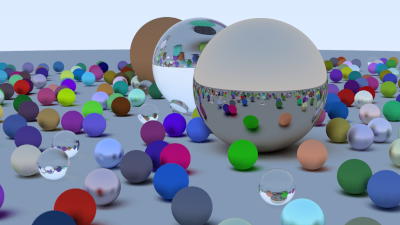

[](https://github.com/ericwoude/ray-tracer/actions/workflows/main.yml)
[](https://github.com/ericwoude/ray-tracer/releases)
[](https://github.com/ericwoude/ray-tracer/blob/main/LICENSE)

# Simple Ray Tracer


An implementation of a basic ray tracer following Ray Tracing In One Weekend [_Ray Tracing in One Weekend_](https://raytracing.github.io/books/RayTracingInOneWeekend.html).

Outside the scope of the book, I added:
- multithreading
- triangle rendering

## Usage
1. Configure the project and generate the native build system, and call the build system to compile and link the project:
```bash
$ make build
```
The compiled executables will be placed in build/bin.

2. Invoke the ray tracer and output the results to a file
```bash
$ ./bin/raytracer > image.ppm
```

## Literature
- Shirley, P. (2016). Ray tracing in one weekend. Amazon Digital Services LLC, 1.
- Möller, T., & Trumbore, B. (1997). Fast, minimum storage ray-triangle intersection. Journal of graphics tools, 2(1), 21-28.